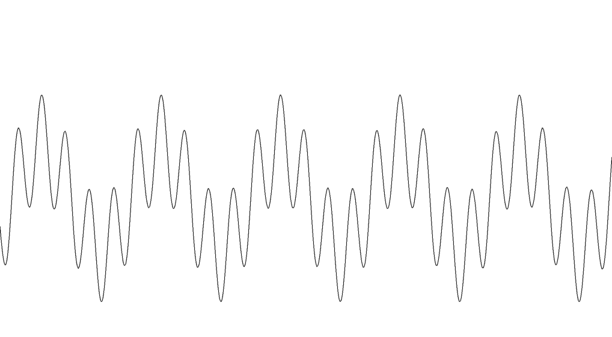

# jsynth
A synthesizer framework to experiment with signal processing and audio creation. Pure java. Useful for testing new ideas.

## Teaser

### Analog-Synth
Analog Synth is a fixed coded analog style synth with 3 Oscillators with saw tooth waveform. Other Waveforms available like pulse (supporting pulse width modulation), sine or noise.

It has a LFO, a 30db all pass filter with ADSR Envelope and a VCA with ADSR envelope. 

### Modular Synth
As modular as possible. Adding Oscillators, LFOs, VCFs, VCAs and connect all this components as needed. Great for experimenting with modulation since everything can modulate anything. Connections are set by adding a connection object. Here a little demo of how to build a modular synth for experimenting with ring modulation in jsynth:
```java
public static ModularSynth createRingModulatedSynth(SoundFormat sf) {
    // Modular synthesizer with one voice
    ModularSynth ms = new ModularSynth(1);
    // add a sine wave oscillator
    ms.addComponent("osc1", () -> new Oscillator(sf, new SineWaveFunction(sf)));
    // add a second sine wave oscillator
    ms.addComponent("osc2", () -> new Oscillator(sf, new SineWaveFunction(sf)));
    // Connect Oscillator 1 out to Synth out (that's what you hear)
    ms.setOutValue("osc1.out");
    // Connect output of Oscillator 2 to volume input of Oscillator 1
    ms.addComponent("ringmod", () -> new SignalConnection(ms, "osc2.out", "osc1.volume"));
    // Build the synth (analyze signal flow, cache reflective access etc..)
    ms.build();
    return ms;
}
```

Now take this synth and lets play a tone:
```java
 @Test
 public void testRingModulation() throws Exception {
    SoundFormat sf = SynthContext.soundFormat;
    // Create a Synth with two Sine-Wave Oscillators
    ModularSynth ms = ModularSynthCreator.createRingModulatedSynth(sf);

    // Modulate C4 as Carrier with G4 as Modulator
    ms.setValue("osc1.frequence", PianoKeys.A4.f());
    ms.setValue("osc2.frequence", PianoKeys.E5.f());
    ms.setValue("ringmode.rate", 0.5f);
    // Sample 15 carrier periods of audio
    float duration = 1.0f / PianoKeys.A4.f() * 15.0f;
    float[] buffer = recordSamples(duration, sf, ms);
    // Play and visualize the audio
    audioTestSupport.playSoundData(buffer, sf.sampleRate);
}
```

Here is the resulting wave form:



And here how it sounds:
[test.wav](doc/images/test.wav)

