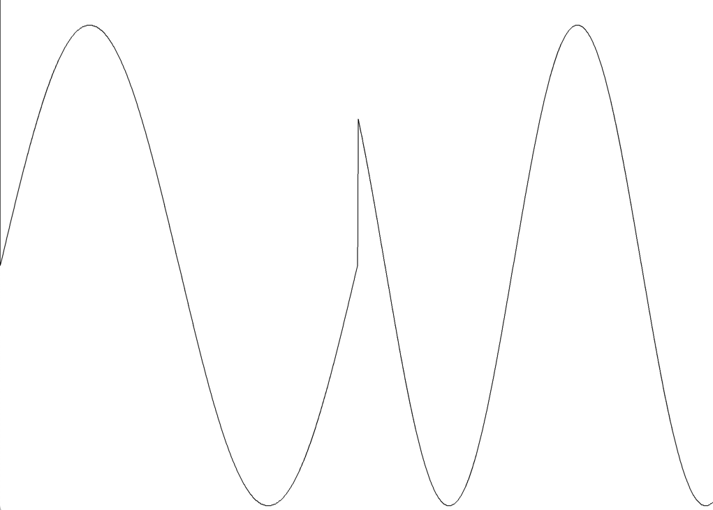
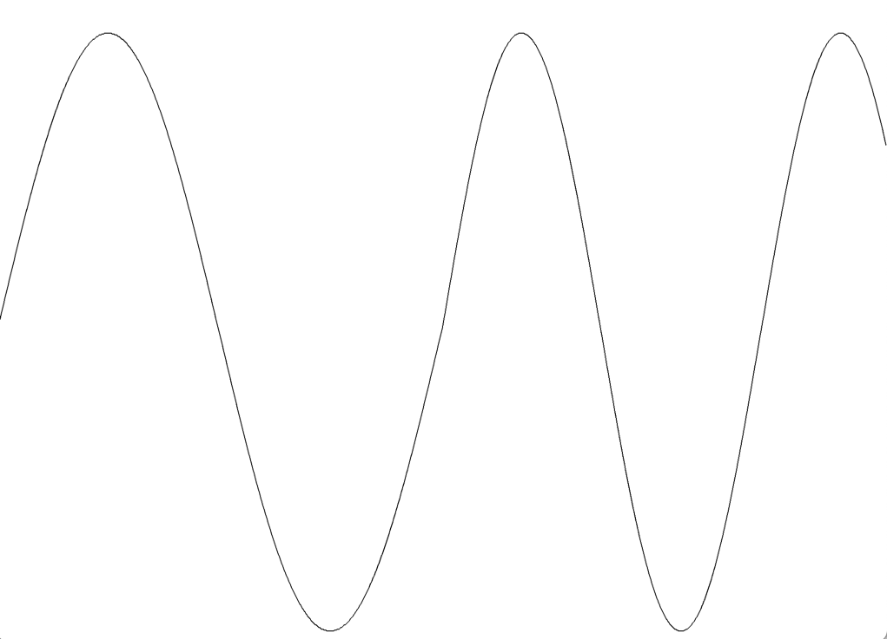

# Frequence-Modulation and the simple sine wave generator

jsynth provides two sine wave generators that can be used in an Oscillator as a wave source. The reason for these two implementation is described here

## Introducing frequency modulation (FM)

With the implementation of the modular synth jsynth opens the field for connecting modulators to every signal input. I first did some experiments with ring modulation, where one oscillator modulates the volume of a second audible oscillator. That was quite successfull.

After that success I wanted to see how FM would sound and connected the output of oscillator 2 to the frequence modulation input of oscillator 1 and listen to the result. Short form: IT SOUNDS HORRIBLE!

But why was this the case? I debugged all synth states. Logged CSV-Files and displayed them in Excel and everything looks well. The modulation was correct, the frequence values where correct. Except the output was totally wrong. So a had to rethink what's going on here.

## The simple sine implementation

The SineWaveFunction calculates the value of a sample _s_ at time _t_ with frequnecy _f_. It does it by simply returning: 
> s = Maht.sin(2 * Math.PI * t * f);

That's absolutely correct and produces a clear sinus sound if used in an oscillator. But what happens if the frequency _f_ changes over time? 

### Math.sin has an implicit assumption
The result of Math.sin(2 * _PI_ * _t_ * _f_) assumes that the given frequency _f_ is valid since the beginning of time (_t_ = 0). But when the frequency is modulated, that's no longer true! So a sine wave function, that supports frequency modulation has to be aware of it!

Here is a little plot of the result from the SineWaveFunction running at _f_=83HZ and out of a sudden, at the middle of the plot the frequency is set to _f_=120HZ.



As you can see... this is not exactly what expected. While for simple "now and then changes" that may be acceptable (like when playing with a Keyboard) when running frequency modulation this is surely not correct. The result is really strange, I can tell you.

_But what to do?_

## Take the phase
If you think of an oscillator as a spinning wheel, then the FM modulation modulates the speed of this wheel and makes it turning faster or slower.

So instead of simple calling Math.sin(2 * _PI_ * _t_ * _f_) it is necessary to remember the position of the wheel at the last sample and calculate the next position relative to the previous one. The change of the position is determined by the frequency (the speed of the wheel).

The position of the wheel is called the phase. The delta of the phase over one sample depends on the duration of one sample which is 1/SampleRate multiplied by the frequency. So (sr is the sample rate)


> _delta(p)_ = 2 * _PI_ * 1/_sr_ * _f_ 


Here is the code for a phase driven sine wave generator:

```java
phase += 2 * Math.PI / sampleRate  * f;
phase %= 2 * Math.PI;
return Math.sin(phase);
```
phase is a state of the wave generator. To prevent it from running over MAX_VALUE it is keept module 2 PI which is the duration of a sine wave.

## Does it help?

A LOT! Here is the same experiment with the phase driven sine wave function:



You can see the smooth transition from f=83HZ to f=120HZ at the middle of the plot. And the sound is exactly what you would expect from a frequency modulated sine wave.

# Conclusion:

Simple: Take the PhasedSineWave generator nearly always! And more over. The same conclusion is valid for the other wave functions. All the wave functions are now phase driven and can deal with frequency modulation.

The general concept is:
